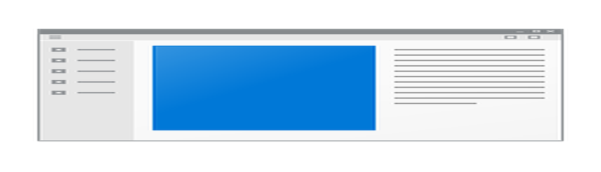

<p align="center">
  <br>
  <a href="#빌드�위한 �시 단계">빌드</a> �
  <a href="#Docker�빌드하는 방법">Docker</a> �
  <a href="#파� 구조">구조</a> �
  <a href="#스�린샷">스냇�/a><br>
  [<a href="../README.md">English</a>] | [<a href="README-UA.md">Україн�ька</a>] | [<a href="README-CS.md">�esky</a>] | [<a href="README-ZH.md">中文</a>] | [<a href="README-HU.md">Magyar</a>] | [<a href="README-ES.md">Español</a>] | [<a href="README-FA.md">�ارسی</a>] | [<a href="README-FR.md">Français</a>] | [<a href="README-DE.md">Deutsch</a>] | [<a href="README-PL.md">Polski</a>] | [<a href="README-ID.md">Indonesian</a>] | [<a href="README-FI.md">Suomi</a>] | [<a href="README-ML.md">മലയാളം</a>] | [<a href="README-JP.md">日本�/a>] | [<a href="README-NL.md">Nederlands</a>] | [<a href="README-IT.md">Italiano</a>] | [<a href="README-RU.md">Ру��кий</a>] | [<a href="README-PTBR.md">Português (Brasil)</a>] | [<a href="README-EO.md">Esperanto</a>] | [<a href="README-KR.md">한국�/a>] | [<a href="README-AR.md">العربي</a>] | [<a href="README-VN.md">Tiếng Việt</a>] | [<a href="README-DA.md">Dansk</a>] | [<a href="README-GR.md">Ελληνικά</a>] | [<a href="README-TR.md">Türkçe</a>] | [<a href="README-NO.md">Norsk</a>]<br>
  <b>�README, <a href="https://github.com/rustdesk/rustdesk/tree/master/src/lang">RustDesk UI</a> �<a href="https://github.com/rustdesk/doc.vlanl.com">RustDesk 문서</a>�귀하� 모국어로 번역하는 ��움�필요합니�/b>
</p>

> [!Caution]
> **오용 면책 조항:** <br>
> RustDesk�개발�는 �소프트웨어� 비윤리� �는 불법�� 사용�묵�하거�지�하지 않습니다. 무단 액세� 제어 �는 개�정보 침해와 같� 오용� 엄격하게 당사�지침� 위배�니� �성�는 �용 프로그��오용�대�책��지지 않습니다.


우리와 채팅: [Discord](https://discord.gg/nDceKgxnkV) | [Twitter](https://twitter.com/rustdesk) | [Reddit](https://www.reddit.com/r/rustdesk) | [YouTube](https://www.youtube.com/@rustdesk)

[](https://vlanl.com/pricing.html)

�하나��격 �스�톱 솔루션으� Rust��성�었습니� 별��설정 없� 바로 사용���습니다. ��터� 대�완전�통제권� 가지�보안�대�걱정�없습니다. 저���부/릴레�서버�사용하거� [�접 설정](https://vlanl.com/server)하거� [�신만� ��부/릴레�서버��성](https://github.com/rustdesk/rustdesk-server-demo)���습니다.


RustDesk�모든 분들�기여�환�합니� 시�하는 ��움�필요하면 [CONTRIBUTING-KR.md](CONTRIBUTING-KR.md)�참조하세�

[**�주 묻는 질문**](https://github.com/rustdesk/rustdesk/wiki/FAQ)

[**바�너리 다운로드**](https://github.com/rustdesk/rustdesk/releases)

[**개발�빌드**](https://github.com/rustdesk/rustdesk/releases/tag/nightly)

[](https://f-droid.org/en/packages/com.vlanl.Svahost)
[](https://flathub.org/apps/com.vlanl.Svahost)

## 종��

�스�톱 버전� GUI�Flutter �는 Sciter (��� 지��지 않�)�사용하며, ��습서는 시�하기 �쉽고 친숙�Sciter 전용�니� Flutter 버전 빌드�[CI](https://github.com/rustdesk/rustdesk/blob/master/.github/workflows/flutter-build.yml)�확�하세�

Sciter �� ��브러리를 �접 다운로드하세�

[Windows](https://raw.githubusercontent.com/c-smile/sciter-sdk/master/bin.win/x64/sciter.dll) |
[Linux](https://raw.githubusercontent.com/c-smile/sciter-sdk/master/bin.lnx/x64/libsciter-gtk.so) |
[macOS](https://raw.githubusercontent.com/c-smile/sciter-sdk/master/bin.osx/libsciter.dylib)

## 빌드�위한 �시 단계

- Rust 개발 환경�C++ 빌드 환경�준비합니다

- [vcpkg](https://github.com/microsoft/vcpkg)�설치하고 `VCPKG_ROOT` 환경 변수를 올바르게 설정합니�

  - Windows: vcpkg install libvpx:x64-windows-static libyuv:x64-windows-static opus:x64-windows-static aom:x64-windows-static
  - Linux/macOS: vcpkg install libvpx libyuv opus aom

- `cargo run` 실행

## [빌드](https://vlanl.com/docs/en/dev/build/)

## Linux�서 빌드하는 방법

### Ubuntu 18 (Debian 10)

```sh
sudo apt install -y zip g++ gcc git curl wget nasm yasm libgtk-3-dev clang libxcb-randr0-dev libxdo-dev \
        libxfixes-dev libxcb-shape0-dev libxcb-xfixes0-dev libasound2-dev libpulse-dev cmake make \
        libclang-dev ninja-build libgstreamer1.0-dev libgstreamer-plugins-base1.0-dev libpam0g-dev
```

### openSUSE Tumbleweed

```sh
sudo zypper install gcc-c++ git curl wget nasm yasm gcc gtk3-devel clang libxcb-devel libXfixes-devel cmake alsa-lib-devel gstreamer-devel gstreamer-plugins-base-devel xdotool-devel pam-devel
```

### Fedora 28 (CentOS 8)

```sh
sudo yum -y install gcc-c++ git curl wget nasm yasm gcc gtk3-devel clang libxcb-devel libxdo-devel libXfixes-devel pulseaudio-libs-devel cmake alsa-lib-devel gstreamer1-devel gstreamer1-plugins-base-devel pam-devel
```

### Arch (Manjaro)

```sh
sudo pacman -Syu --needed unzip git cmake gcc curl wget yasm nasm zip make pkg-config clang gtk3 xdotool libxcb libxfixes alsa-lib pipewire
```

### vcpkg 설치

```sh
git clone https://github.com/microsoft/vcpkg
cd vcpkg
git checkout 2023.04.15
cd ..
vcpkg/bootstrap-vcpkg.sh
export VCPKG_ROOT=$HOME/vcpkg
vcpkg/vcpkg install libvpx libyuv opus aom
```

### libvpx 수정 (Fedora� 

```sh
cd vcpkg/buildtrees/libvpx/src
cd *
./configure
sed -i 's/CFLAGS+=-I/CFLAGS+=-fPIC -I/g' Makefile
sed -i 's/CXXFLAGS+=-I/CXXFLAGS+=-fPIC -I/g' Makefile
make
cp libvpx.a $HOME/vcpkg/installed/x64-linux/lib/
cd
```

### 빌드

```sh
curl --proto '=https' --tlsv1.2 -sSf https://sh.rustup.rs | sh
source $HOME/.cargo/env
git clone --recurse-submodules https://github.com/rustdesk/rustdesk
cd rustdesk
mkdir -p target/debug
wget https://raw.githubusercontent.com/c-smile/sciter-sdk/master/bin.lnx/x64/libsciter-gtk.so
mv libsciter-gtk.so target/debug
VCPKG_ROOT=$HOME/vcpkg cargo run
```

## Docker�빌드하는 방법

먼저 리�지토리�복제하고 Docker 컨테�너�빌드합니�

```sh
git clone https://github.com/rustdesk/rustdesk
cd rustdesk
git submodule update --init --recursive
docker build -t "rustdesk-builder" .
```

그런 다� �용 프로그��빌드해야 �때마�다� 명령�실행합니�

```sh
docker run --rm -it -v $PWD:/home/user/rustdesk -v rustdesk-git-cache:/home/user/.cargo/git -v rustdesk-registry-cache:/home/user/.cargo/registry -e PUID="$(id -u)" -e PGID="$(id -g)" rustdesk-builder
```

�번째 빌드�종�성� �시�기까지 시간�오� 걸릴 ��으� �후 빌드��빨�집니� �한 빌드 명령�다른 �수�지정해�하는 경우 명령 �� `<OPTIONAL-ARGS>` 위치��수�지정할 ��습니다. 예를 들어 최�화� 릴리�버전�빌드하려�위� 명령 뒤� `--release`�추가하면 �니� 결과 실행 파�� 시스템� 대����서 사용���으�실행���습니다::

```sh
target/debug/rustdesk
```

�는 릴리�실행 파��실행하는 경우:

```sh
target/release/rustdesk
```

RustDesk 리�지토리�루트�서 �러�명령�실행하고 �는지 확�하세� 그렇지 않으��용 프로그��필요�리소스를 찾지 못할 ��습니다. �한 `install` �는 `run` �같� 다른 cargo 하위 명령� 호스트가 아닌 컨테�너 내부�프로그��설치하거�실행하므�현� �방법�통해 지��지 않는다는 �� 유�하세�

## 파� 구조

- **[libs/hbb_common](https://github.com/rustdesk/rustdesk/tree/master/libs/hbb_common)**: 비디�코�, 구성, tcp/udp wrapper, protobuf, 파� 전송�위한 fs 함수 �기타 유틸리티 함수
- **[libs/scrap](https://github.com/rustdesk/rustdesk/tree/master/libs/scrap)**: 화면 캡�
- **[libs/enigo](https://github.com/rustdesk/rustdesk/tree/master/libs/enigo)**: 플��별 키보�마우�제어
- **[libs/clipboard](https://github.com/rustdesk/rustdesk/tree/master/libs/clipboard)**: Windows, Linux, macOS�파� 복사 �붙여넣기 구현
- **[src/ui](https://github.com/rustdesk/rustdesk/tree/master/src/ui)**: ��� 사용�지 않는 Sciter UI (지�중단)
- **[src/server](https://github.com/rustdesk/rustdesk/tree/master/src/server)**: 오디��립보드/�력/비디�서비��네트워� 연결
- **[src/client.rs](https://github.com/rustdesk/rustdesk/tree/master/src/client.rs)**: 피어 연결 시�
- **[src/rendezvous_mediator.rs](https://github.com/rustdesk/rustdesk/tree/master/src/rendezvous_mediator.rs)**: [rustdesk-server](https://github.com/rustdesk/rustdesk-server)와 통신, �격 다�렉트 (TCP 홀 �� �는 릴레�연결 대�
- **[src/platform](https://github.com/rustdesk/rustdesk/tree/master/src/platform)**: 플��별 코드
- **[flutter](https://github.com/rustdesk/rustdesk/tree/master/flutter)**: �스�톱 �모바�용 Flutter 코드
- **[flutter/web/js](https://github.com/rustdesk/rustdesk/tree/master/flutter/web/v1/js)**: Flutter ����언트용 JavaScript

## 스�린샷


